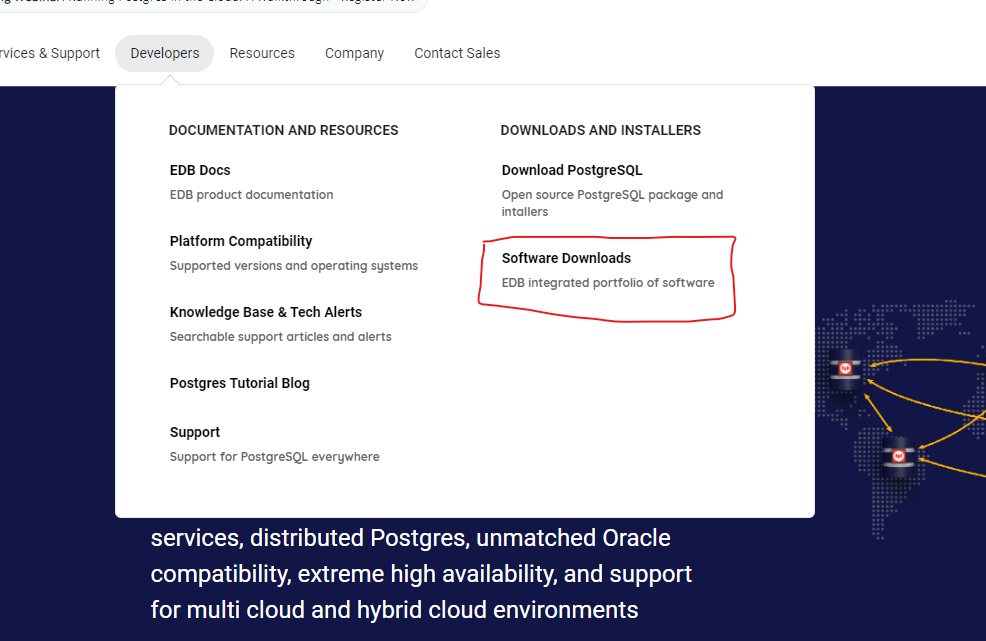
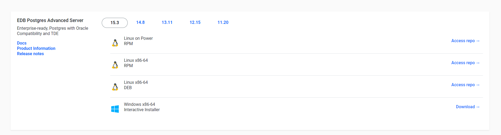
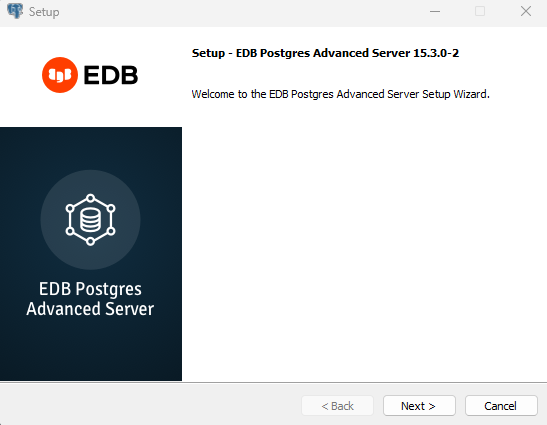
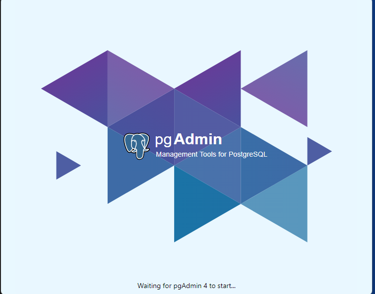
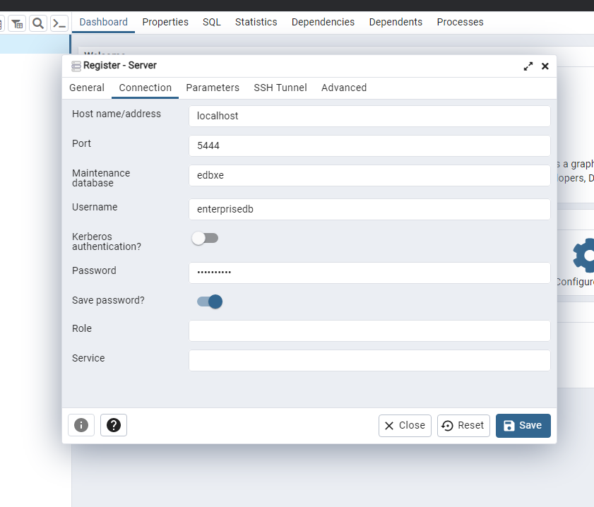
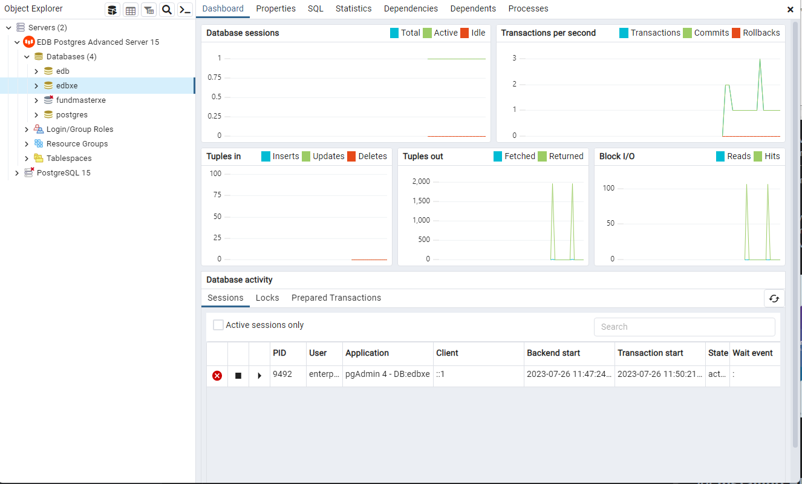

# EDB Postgres database Setup
------------------------

## Installation
---------------
EDB Postgres Advanced Server 15 is built on open-source PostgreSQL 15, which introduces myriad enhancements that enable databases to scale up and scale out in more efficient ways.

The EDB Postgres Advanced Server documentation describes the latest version of EDB Postgres Advanced Server 15 including minor releases and patches. These release notes provide information on what was new in each release.

Before you can do installation  for edb database you need to open an account with them.
 [Click Here to Register](https://www.enterprisedb.com/)

Use the steps below to down

### 1. Windows Installation 
 i. From the edb website click on the develpers -> Software downloads
 

ii. Choose the appropriate version of EDB Advanced Server based on your Windows operating system (32-bit or 64-bit).
Make sure the version you select is compatible with your Windows version.

iii. Once the download is complete run the Installer

iv. Start EDB Advanced Server 
After installation, you can start the EDB Advanced Server by running the "pg_ctl" utility or by starting the EDB Advanced Server service through the Windows Services Manager.

v. Connect and Verify:
Use your preferred database client (e.g., pgAdmin) to connect to the EDB Advanced Server and verify that it's up and running.

### 2. Linux Installation

## Installing EDB JDBC Connector
---------------

## Setting EDB on Wildfly
---------------

## Deployment
---------------