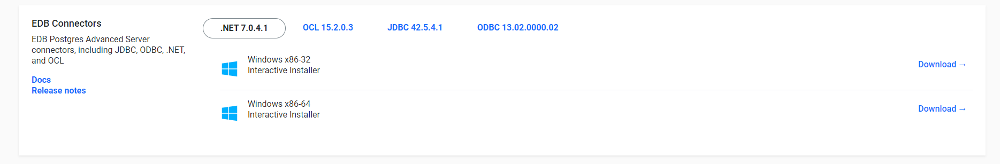

# EDB Postgres database Setup
------------------------

## Installation
---------------
EDB Postgres Advanced Server 15 is built on open-source PostgreSQL 15, which introduces myriad enhancements that enable
databases to scale up and scale out in more efficient ways.

The EDB Postgres Advanced Server documentation describes the latest version of EDB Postgres Advanced Server 15 including
minor releases and patches. These release notes provide information on what was new in each release.

Before you can do installation for edb database you need to open an account with them.
[Click Here to Register](https://www.enterprisedb.com/)

Use the steps below to down


### 1. Windows Installation
------------------

#### i. From the edb website click on the develpers -> Software downloads


#### ii. Choose the appropriate version of EDB Advanced Server based on your Windows operating system (32-bit or 64-bit).

Make sure the version you select is compatible with your Windows version.


#### iii. Once the download is complete run the Installer


#### iv. Start EDB Advanced Server

After installation, you can start the EDB Advanced Server by running the "pg_ctl" utility or by starting the EDB
Advanced Server service through the Windows Services Manager.

#### v. Connect and Verify:

Use your preferred database client (e.g., pgAdmin) to connect to the EDB Advanced Server and verify that it's up and
running.


### 2. Linux Installation

## Installing EDB JDBC Connector
---------------
EDB Connectors (also known as EDB Postgres Connectors) enable you to connect your applications to EDB Advanced Server (
formerly EnterpriseDB Advanced Server) and integrate with other systems. The installation process may vary depending on
the specific connector you want to use (e.g., ODBC, JDBC,

### 1. Windows
-------------

#### i.Visit the EDB Website:

[Go to the EDB website](https://www.enterprisedb.com/)
Navigate to the "Products" or "Downloads" section.


#### ii. Select EDB Connectors:

Look for the appropriate EDB Connector you want to install. For example:
EDB ODBC Connector
EDB JDBC Connector
EDB .NET Data Provider
EDB Python Connector, etc.



#### iii. Choose the Download:

Select the download link for the EDB Connector that matches your application's requirements and Windows operating system
version (32-bit or 64-bit).

#### iv. Installation Progress:

The installer will install the EDB Connector components on your Windows system. Wait for the installation to complete.
Installation Complete:

#### v. Verify Installation (Optional):

Depending on the connector type, you may need to configure your application or system to use the installed EDB
Connector. [Consult the documentation](https://www.enterprisedb.com/docs/epas/14/connectors/) provided by EDB for
specific instructions on how to use the connector with your applications.

### 2. Linux Operating System

## Choosing the configuration mode
-----------------------
EDB Postgres Advanced Server (EPAS) also has a significant amount of Oracle compatibility features which facilitate
Oracle to Postgres migrations. When configured to run in Oracle mode, EPAS includes extended functionality that provides
compatibility for syntax supported by Oracle applications, as well as compatible procedural logic, data types, system
catalog views and other features that enable EDB’s Oracle compatible connectors, EDB*Plus, EDB*Loader as well as other
functionality.

When you initialize your EPAS cluster using the initdb command, you can choose whether or not to include these
compatibility features by specifying a configuration mode.

There are two options for the configuration mode:

- Specify the ``` no-redwood-compat ``` option to create the cluster in Postgres mode. When the cluster is created in
  PostgreSQL mode, it includes all of the advanced features that help you maintain, secure, and operate your database
  environment. While some EPAS features compatible with Oracle databases are available with this mode, such as Oracle
  style packages and collections, we recommend using the EDB Postgres Advanced Server in redwood compatibility mode if
  you are implementing an Oracle to Postgres migration.

- Specify the ``` redwood-like ``` option to create the cluster in Oracle compatibility mode. This mode enables all of
  the rich Oracle compatibility features to help you facilitate your Oracle to Postgres migration. These features
  include Oracle compatible custom data types, keywords, functions, and catalog views. You can find details about these
  features in [Working with Oracle data](https://www.enterprisedb.com/docs/epas/latest/working_with_oracle_data/)

## Database compatibility for Oracle developers

- EDB Postgres Advanced Server makes Postgres look, feel, and operate more like Oracle, so when you migrate, there is
  less code to rewrite, and you can be up and running quickly.
  The [Oracle compatibility features](https://www.enterprisedb.com/docs/epas/latest/fundamentals/epas_fundamentals/epas_compat_ora_dev_guide/)
  allow you to run many applications written for Oracle in EDB Postgres Advanced Server with minimal to no changes.

## Creating Database
--------------------

#### 1. Connect to EDB Postgres Server:

- Open your preferred PostgreSQL client tool (e.g., psql, pgAdmin, DBeaver, etc.).
  Provide the necessary connection details, such as hostname, port, username, and password, to connect to your EDB
  Postgres server.

#### 2. Connect as Superuser (Optional):

- By default, you may need to connect as a superuser (e.g., "postgres") to create a new database. Superusers have the
  necessary privileges to create databases and manage the PostgreSQL instance. If you are already connecting as a
  superuser, you can skip this step.

#### 3. Open SQL Console (Optional):

- If you are using a graphical client like pgAdmin or DBeaver, you can open a SQL console or query editor to execute SQL
  commands directly.

#### 4. Create the Database:

- Use the ```CREATE DATABASE``` SQL command to create a new database. Replace ```your_database_name``` with the desired
  name for your new database.

```postgresql
CREATE DATABASE your_database_name;

```

For example, to create a database named "my_database," you would execute:

```postgresql
CREATE DATABASE your_database_name;
```

#### 5.Verify the Database Creation (Optional):

You can verify that the database was created successfully by listing all the databases in your EDB Postgres instance.
Use the SQL command SELECT datname FROM pg_database; to view all the databases.

```postgresql 
SELECT datname
FROM pg_database;

```

This query will display a list of all the databases, including the one you just created.

#### 6.Grant Permissions (Optional):

- By default, the user who created the database (e.g., the superuser) will have all necessary privileges on the newly
  created database. If you want to grant access to other users, you can do so using SQL commands like GRANT to assign
  specific privileges.
  For example, to grant all privileges on "my_database" to a user named "my_user," you would execute:

```postgresql
GRANT ALL PRIVILEGES ON DATABASE my_database TO my_user;

```

## Setting EDB on Wildfly
---------------
Now that you have managed to succesfully setup the database server and creation of database the next thing to do now is
to set up EDB with WildFly.

#### Step 1: Create Module Descriptor

Inside the module directory, create a file named module.xml. This file serves as the module descriptor and contains
information about the module and its dependencies.

```xml
<?xml version="1.0" ?>

<module xmlns="urn:jboss:module:1.1" name="com.edb">

    <resources>
        <resource-root path="edb-jdbc18.jar"/>
    </resources>

    <dependencies>
        <module name="javax.api"/>
        <module name="javax.transaction.api"/>
    </dependencies>
</module>

```

#### Step 2: Configure DataSource in WildFly

Configure a DataSource in WildFly to use the EDB driver. You can do this by editing the standalone.xml configuration
file located in the standalone/configuration directory of your WildFly installation.
Add a <driver> element under the <drivers> subsystem to register the EDB driver, like so:

```xml

<drivers>
    <driver name="edbpostgres" module="com.edb">
        <driver-class>com.edb.Driver</driver-class>
        <xa-datasource-class>com.edb.xa.PGXADataSource</xa-datasource-class>
    </driver>
</drivers>
```

Now define your DataSource configuration in the standalone.xml file, specifying the EDB driver you just registered.
Here's an example:

```xml

<datasource jndi-name="java:jboss/datasources/edb_jndi_name" pool-name="edb_jndi_name">
    <connection-url>jdbc:edb://0.0.0.0:5444/datasource</connection-url>
    <driver>edbpostgres</driver>
    <security>
        <user-name>edb_user</user-name>
        <password>edb_user_password</password>
    </security>
    <validation>
        <valid-connection-checker
                class-name="org.jboss.jca.adapters.jdbc.extensions.postgres.PostgreSQLValidConnectionChecker"/>
        <validate-on-match>true</validate-on-match>
        <background-validation>false</background-validation>
        <exception-sorter class-name="org.jboss.jca.adapters.jdbc.extensions.postgres.PostgreSQLExceptionSorter"/>
    </validation>
</datasource>
```

Note : Make sure the `edb_jndi_name` is well configured.

## Deployment
---------------